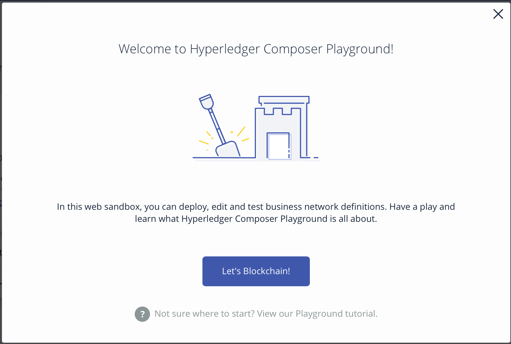
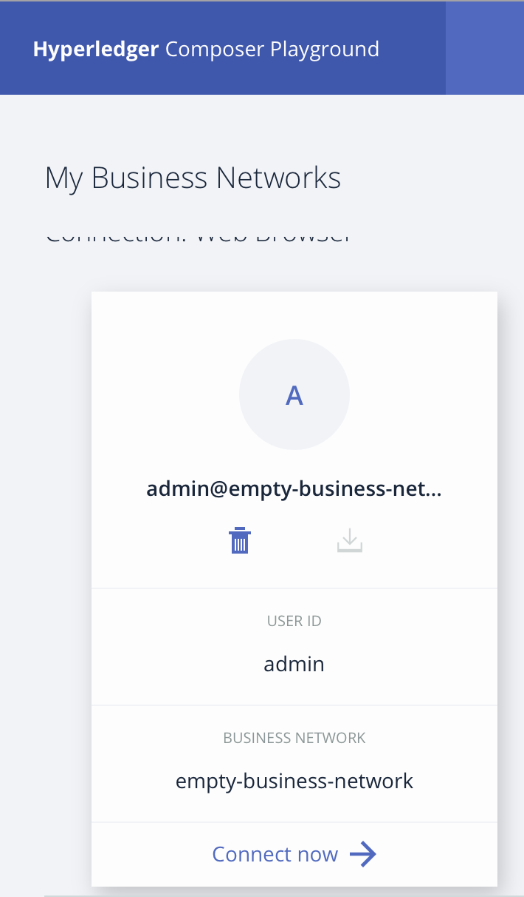
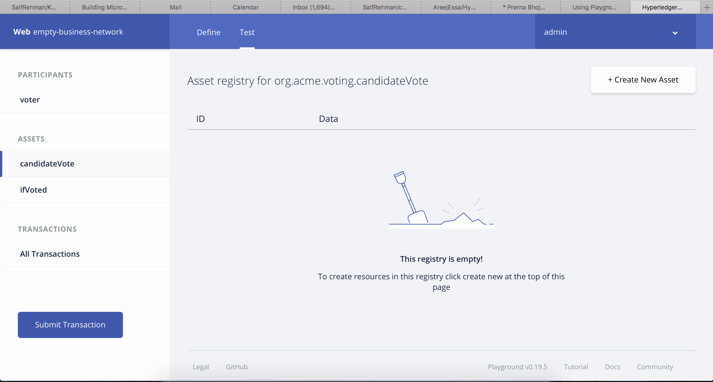

# composer-voting-app


## Learning objectives

In this tutorial you will create and deploy a voting application based on Hyperledger Composer and test on Composer Playground 

## Estimated time

It will take around 10 minutes roughly to create and test your application on Composer Playground

## Introduction
The Hyperledger Composer Playground provides a user interface for the configuration, deployment and testing of a business network. Advanced Playground features permit users to manage the security of the business network, invite participants to business networks and connect to multiple blockchain business networks.

## Steps
1. Navigate to [Composer Playground](http://composer-playground.mybluemix.net)
2. Click on Let's Blockchain

3. Click on Deploy a new buisness network, then select empty-buisness-network, and click on deploy
4. Connect to the buisness network 

5. Paste in the following code on models/models/cto file
```JavaScript
/**
 * Write your model definitions here
 */
namespace org.acme.voting

participant voter identified by voterID {
  o String voterID
  o String fullName
}

asset ifVoted identified by voterID {
  o String voterID
  o Boolean votedOrNot
}

asset candidateVote identified by politicalParty {
  o String politicalParty
  o Integer totalVote
}
transaction vote {
  --> candidateVote candidateVoteAsset
  --> ifVoted ifVotedAsset
}
```
6. Click on ```add a file``` and add ```lib/script.js```
7. Paste the following code at ```lib/script.js```

```JavaScript
'use strict';
/**
 * Write your transction processor functions here
 */

/**
 * Sample transaction
 * @param {org.acme.voting.vote} vote
 * @transaction
 */
function vote(tx) {
    if (!tx.ifVotedAsset.votedOrNot) {
        tx.candidateVoteAsset.totalVote = tx.candidateVoteAsset.totalVote + 1;
        return getAssetRegistry('org.acme.voting.candidateVote')
            .then(function (assetRegistry) {
                return assetRegistry.update(tx.candidateVoteAsset);
            })
            .then(function () {
                return getAssetRegistry('org.acme.voting.ifVoted')
                    .then(function (assetRegistry) {
                        tx.ifVotedAsset.votedOrNot = true;
                        return assetRegistry.update(tx.ifVotedAsset);
                    })
            });
    }
}
```
8. Click on Deploy
9. Now go to ```test``` tab to test your application where you can create assets, participants, and do some transactions]

## Summary
In this tutorial we have built a quick prototype to create a voting application based on Hyperledger Composer
## References


